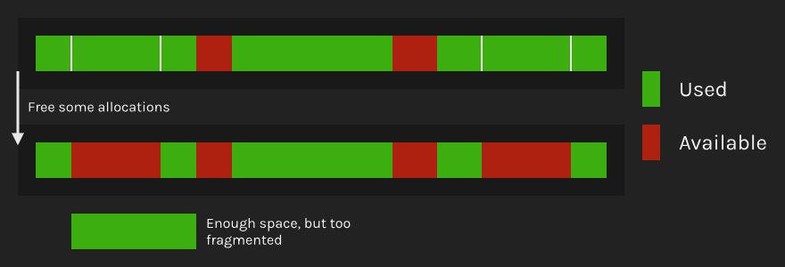
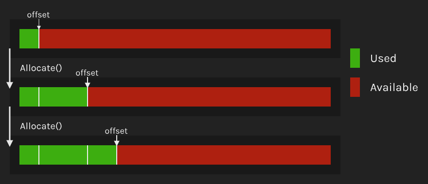
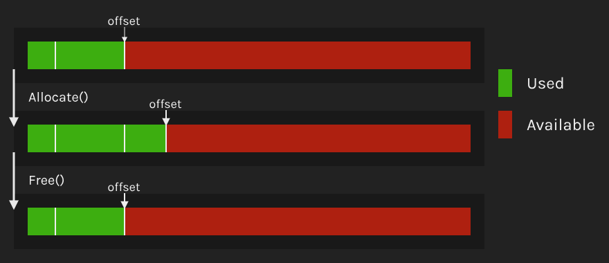
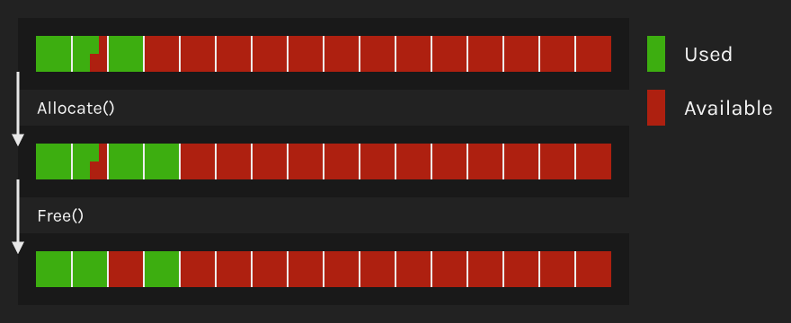

Lately, I have been playing around with the implementation of custom allocators and arenas to replace native allocations on my C++ projects.

Wow! Stop right there, Miguel. This line already deserves some introductions!
Let's talk about allocators.

## Crash course on allocations

To keep this brief, I will assume that we have some experience with C++ and heap allocation (`malloc` and `new`).

An **allocation** is when we request a pointer to a block of memory of a specified size.
When we use `malloc` or `new` we are getting this block of memory from the heap.

When we **deallocate** a pointer (calling `free` or `delete`) its block of memory becomes once again available and no longer needed by us.

## What are Allocators and Arenas

The definition of an allocator is somewhat flexible. It involves the encapsulation of allocation and deallocation of memory.

The allocators provided by the STD (the C++ standard library) are templated objects bound to a type.
For example, `std::vector` can have different allocators.

In game development, we also use allocators as global memory managers.
Using them, we can optimize allocations for specific parts of a game engine.
For example, we can have an allocator that contains one render frame of data and gets cleared when a new frame starts.

But... Isn't it confusing to call everything an allocator?
I believe it is, and I don't seem to be the only one because some engines call the global memory allocators *arenas*.

Therefore, let's stick with the following terminology:

 > 
 > **Allocators** are objects that encapsulate allocation and deallocation of memory

 > 
 > **Arenas** are independent (often global) allocators

 > 
 > **Container Allocators** are stateful allocators that manage the memory used by a container

## Why are they necessary?

Native allocation needs to work in all scenarios.
It behaves like a general-purpose arena, meaning it can't have limitations, and it must be good enough at doing everything.
All this, while lacking any context about our particular use case.

Knowing this, I can think of three performance benefits from allocators:
**Allocation/free cost**, **memory locality** and **fragmentation**.

 > 
 > **Allocation/Free Cost**
 > 
 > `malloc` acts as the intermediary between the program and the OS.
 > For example, sometimes it will need to request more memory from the Kernel, and that is very slow

 > 
 > **Memory Locality**
 > 
 > Very briefly speaking, modern CPUs have cache-lines, caches and RAM.
 > Since data is retrieved in blocks into the caches, if the data we need is cohesive, it's much more likely that it will be already cached.
 > Accessing RAM instead of CPU cache can be hundreds of times slower.
 > 
 > Since `malloc` and `new` don't have context about our memory use-cases, the pointers allocated can be anywhere.
 > However, allocators can give us much better memory locality.

 > 
 > **Fragmentation**
 > 
 > Fragmentation occurs when we have allocated and freed multiple times leaving gaps that are not big enough to fit new allocations.
 > 
 > This means we will need to request more memory. Some allocator algorithms don't have fragmentation at all. Others have the information to reduce it further than `malloc` can.

From a technical design standpoint, we will also simplify code, *visualizing* where memory is held at all times and under which rules.
We can use the arena that fits our problem and change it if needed.

## Types of Allocators

There are many types of allocators based on their algorithms.
Each of them brings benefits as well as limitations.

There is no way I could explain all of them, but let me give you a quick rundown of the simplest ones.

### Linear

A **Linear allocator** reserves a big block of memory and then moves an offset to the next available position when allocating.
Since it doesn't keep track of previous allocations, a linear allocator **can't be freed**.

This algorithm is by far the most performant due to its simplicity.
But it also has the most limitations, so its use in the real world is very specific.

### Stack

**Stack** is one step more advanced than Linear. It knows the size of all allocations, allowing us to free the **last** allocation.

### Pool

A **Pool** *allocator* contains a list of same size slots. All allocations must be smaller than one slot.

To track which slots are available, we can use a bitset.
They are very performant and compact containers where 1 bit represents one occupied slot.

Some implementations keep track of allocations using a linked list.
However, this means we need to iterate over the entire memory block. It also introduces 8 extra bytes for each allocation.

### General

A **general** allocator can be used for all use-cases and doesn't have any big limitation.
I will soon publish how I implemented a general arena that is up to **130x** faster than `malloc`.

### Many more!

Those were not all allocators that exist. There are many more.
Each algorithm has advantages and disadvantages, and it's up to us to choose the best one for the job.

Some I didn't mention:

* [Buddy allocator](https://en.wikipedia.org/wiki/Buddy_memory_allocation)
* [Slab allocator](https://www.geeksforgeeks.org/operating-system-allocating-kernel-memory-buddy-system-slab-system/)

## Native allocation replacements

Some libraries just provide an extra layer between us and `malloc` but not necessarily using the concepts we described before.
They still lack context about our use-case and need to solve every problem just like `malloc`. However, they manage to be considerably faster than the default solution.

Depending on what you do, these libraries might be enough. However, setup is not always as intuitive and straight-forward as it should be.

One example is [microsoft/mimalloc](https://github.com/microsoft/mimalloc "||blank").

## Resources

* [Writing a Game Engine from Scratch - Part 2: Memory](https://gamasutra.com/blogs/MichaelKissner/20151104/258271/Writing_a_Game_Engine_from_Scratch__Part_2_Memory.php)
* [CppCon 2014: Mike Acton "Data-Oriented Design and C++"](https://youtu.be/rX0ItVEVjHc?t=1830)
* [Custom Vector Allocation](https://www.gamasutra.com/blogs/ThomasYoung/20141002/226898/Custom_Vector_Allocation.php)
* Some allocator implementation examples: [mtrebi/memory-allocators](https://github.com/mtrebi/memory-allocators)
