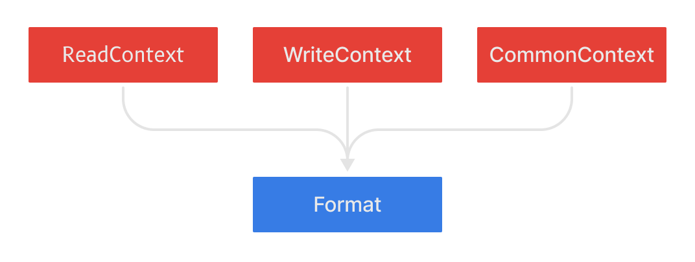

Quite often I find myself working on a programming language, editors, tools, or other projects that require quite a strong serialization solution, which I used to not have.

It is now a different story, since I implemented, once again, my own solution in Pipe.

So, this time let's talk about 
I am going to describe what the serialization architecture looks like in Rift, and why I got there.
I believe it is interesting to play with, and maybe it can bring some new ideas to the topic.

# What is serialization?

In short, Serialization is simply transforming memory into text or binary formats.

Even for those that are familiar with serialization it is important to remember this.
Many serialization libraries try to do too much but fail to do the basics well and that difuses the term.

## What is it for?

Serialization can have many uses.
I suppose the most frequent ones are to store into files, or send over the network.

[**Rift**](https://github.com/PipeRift/rift), for example, uses serialization for files primarily but also for transactions (like Undo/Redo in editor).

-----------------------------------------------------sketch

What are the pieces?

There are two main elements:

* **Contexts**: Facilitates serialization of supported types, and represents a single instance of serialization
* **Format**: Receives basic data structures to be stored into the final data according to the format it implements

It is scoped.

Can have arrays, objects or native values.

 

Consider having a look at [**Rift**](https://github.com/PipeRift/rift), which is a visual compiled programming language.
It would be incredibly helpful to get your ideas, feedback and/or code contributions!
